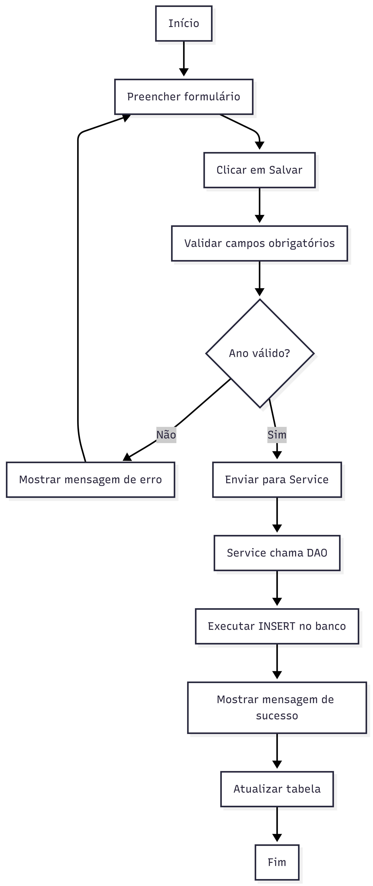
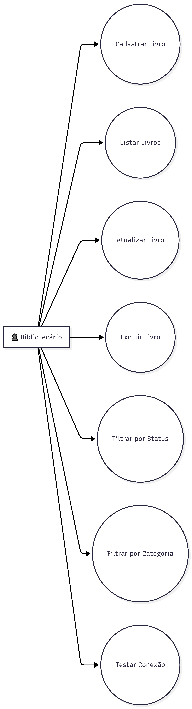
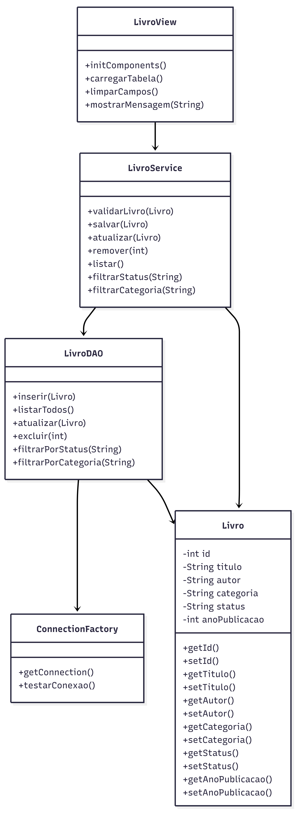

# 📚 Sistema de Gestão de Biblioteca (SGB)


> **Projeto Acadêmico SENAI Betim**  
> Sistema para controle de acervo bibliográfico desenvolvido com foco em arquitetura em camadas e padrões de projeto.

---

## 🚀 Sobre o Projeto

O **SGB** é uma aplicação desktop desenvolvida para consolidar conceitos de **Engenharia de Software**. O projeto utiliza o padrão **MVC (Model-View-Controller)** e **DAO (Data Access Object)** para garantir uma separação clara entre a interface, a lógica de negócio e a persistência de dados.

---

## ✨ Funcionalidades

- 🔍 **Busca e Filtros:** Pesquisa por *Status* e *Categoria*  
- 📊 **Dashboard de Acervo:** Visualização com `JTable`  
- 📝 **CRUD Completo:** Cadastro, edição e exclusão  
- 💾 **Persistência JDBC:** Integração com MySQL  

---

## 🛠️ Tecnologias

| Categoria | Tecnologia |
|----------|----------|
| Linguagem | Java |
| Interface | Swing |
| Build | Apache Ant |
| Banco | MySQL |
| Modelagem | UML |

---

## 📂 Estrutura do Projeto

```text
sistema-gestao-biblioteca/
├── docs/
│   ├── diagramas/
│   │   ├── 1.png
│   │   ├── 2.png
│   │   └── 3.png
│   └── telas/
├── src/
````

---

## 📊 Diagramas UML

### 🔹 Diagrama 1



### 🔹 Diagrama 2



### 🔹 Diagrama 3



---

## 📸 Interface

<div align="center">


</div>

---

## 👥 Equipe

* **Matheus Gustavo** — Backend / Líder
* **Davi Moreno** — Full Stack
* **Bryan Irios** — UI/UX + UML

---

## ⚙️ Como Executar

```bash
# Rodar com Apache Ant
ant run
```

### Passos:

1. Importar `database.sql` no MySQL
2. Abrir no NetBeans
3. Adicionar `mysql-connector`
4. Executar (F6)

---

## 📝 Licença

MIT License

---