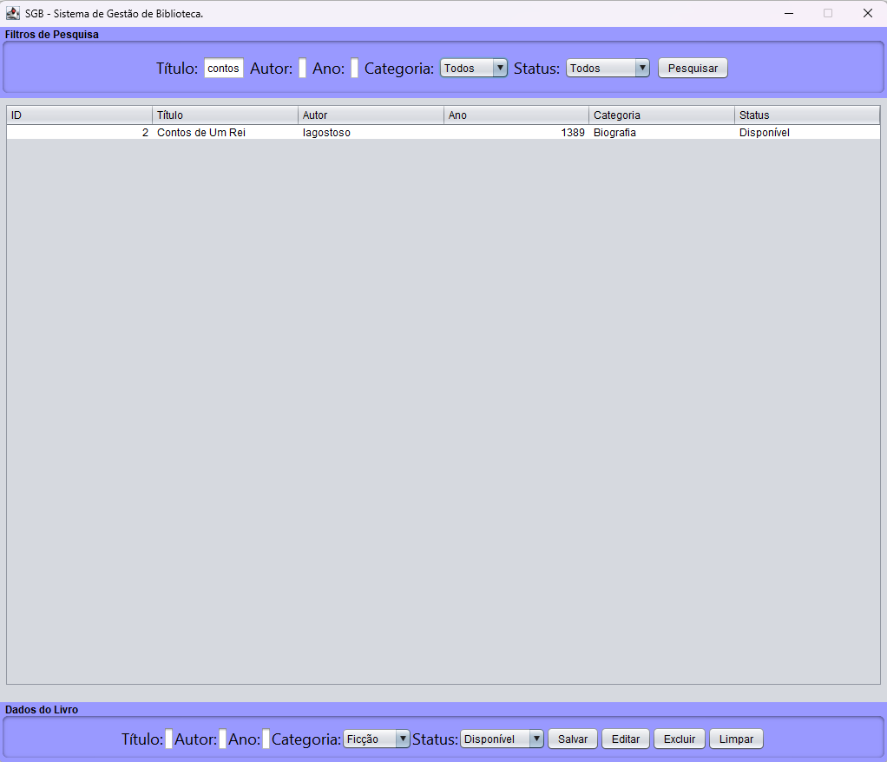
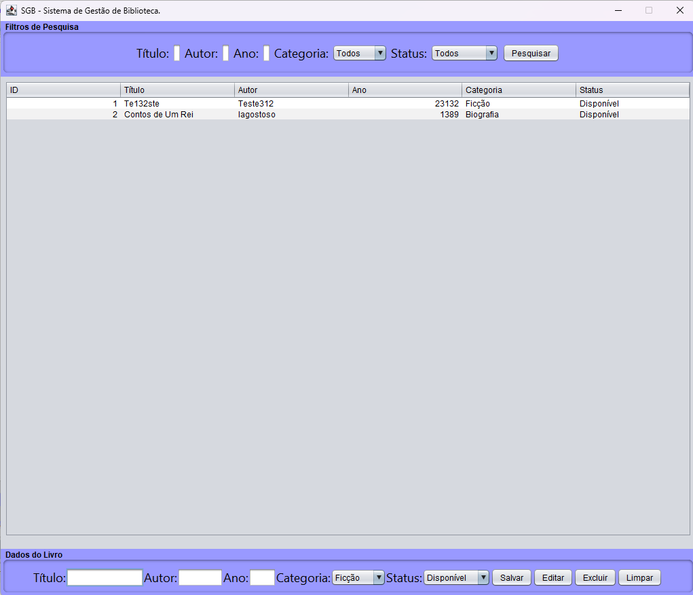

# 📚 Sistema de Gestão de Biblioteca (SGB)


> **Projeto Acadêmico SENAI Betim** > Sistema para controle de acervo bibliográfico desenvolvido com foco em arquitetura em camadas e padrões de projeto.

---

## 🚀 Sobre o Projeto

O **SGB** é uma aplicação desktop desenvolvida para consolidar conceitos de **Engenharia de Software**. O projeto utiliza o padrão **MVC (Model-View-Controller)** e **DAO (Data Access Object)** para garantir uma separação clara entre a interface, a lógica de negócio e a persistência de dados.

### ✨ Funcionalidades
* 🔍 **Busca e Filtros:** Pesquisa dinâmica por *Status* (Disponível, Emprestado, Manutenção) e *Categoria*.
* 📊 **Dashboard de Acervo:** Visualização em grade (`JTable`) com atualização em tempo real.
* 📝 **Operações CRUD:** Cadastro, edição, exclusão e limpeza de campos com validações de domínio.
* 💾 **Persistência JDBC:** Integração com banco de dados **MySQL** via XAMPP.

---

## 🛠️ Tecnologias e Ferramentas

| Categoria | Tecnologia |
| :--- | :--- |
| **Linguagem** | Java SE (OpenJDK) |
| **Interface (GUI)** | Java Swing |
| **Build/Automação** | Apache Ant |
| **Banco de Dados** | MySQL (MariaDB) |
| **Design/UX** | Figma |
| **Modelagem** | UML (Casos de Uso, Classes, Sequência e Atividades) |

---

## 📂 Estrutura do Repositório

```text
sistema-gestao-biblioteca/
├── 📄 LICENSE                 # Licença permissiva MIT
├── 📄 README.md                # Documentação técnica principal
├── 📂 docs/
│   ├── 📂 diagramas/          # Modelagem UML (Bryan Irios)
│   ├── 📂 telas/              # Capturas de tela da interface
│   └── 📄 database.sql         # Script de criação do banco MySQL
└── 📂 sistema-gestao-biblioteca/
    ├── 📄 build.xml            # Configuração do Apache Ant
    ├── 📂 src/                 # Código-fonte organizado por pacotes
    │   └── 📂 br/com/biblioteca/
    │       ├── 📂 model/       # Entidades (Livro.java)
    │       ├── 📂 dao/         # Persistência (LivroDAO.java)
    │       ├── 📂 service/     # Lógica de Negócio (LivroService.java)
    │       └── 📂 view/        # Interface Gráfica (TelaPrincipal.java)
    └── 📂 nbproject/           # Metadados do NetBeans
````

-----

## 📸 Interface do Sistema

\<div align="center"\>
\<p\>\<i\>Capturas de tela da aplicação em execução:\</i\>\</p\>
\
\
\</div\>

-----

## 👥 Equipe de Desenvolvimento

  * **Matheus Gustavo** - *Lead Software Programmer & Backend*
  * **Davi Moreno** - *Full Stack Developer (UI & Integration)*
  * **Bryan Irios** - *UI/UX Designer & UML Modeling*

-----

## ⚙️ Como Executar

1.  Certifique-se de possuir o **JDK** instalado e configurado no PATH.
2.  Importe o script `docs/database.sql` no seu **phpMyAdmin** (XAMPP).
3.  Abra o projeto no **Apache NetBeans**.
4.  Certifique-se de adicionar o driver `mysql-connector-java` às bibliotecas do projeto.
5.  Execute o projeto (**F6**) ou via terminal:
    ```bash
    ant run
    ```

-----

### 📝 Licença

Este projeto está licenciado sob a **MIT License** - veja o arquivo [LICENSE](https://www.google.com/search?q=LICENSE) para detalhes.

-----